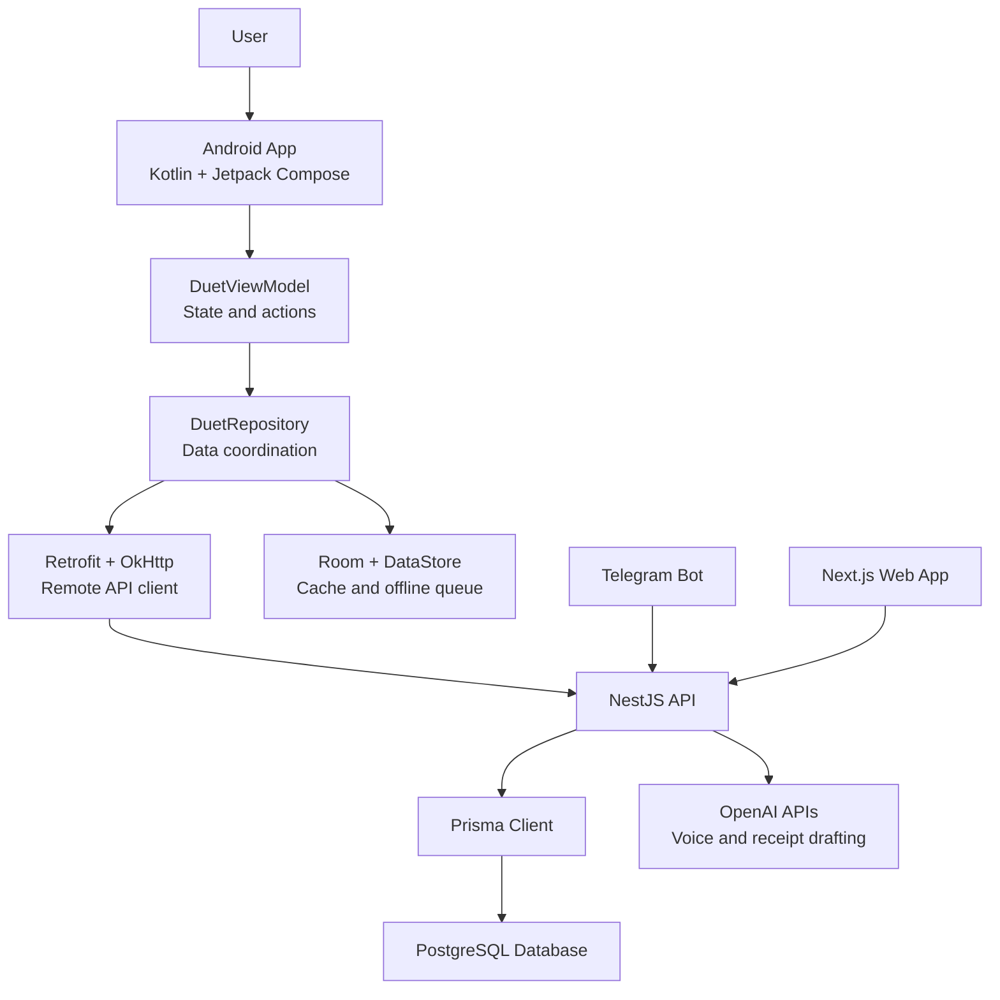
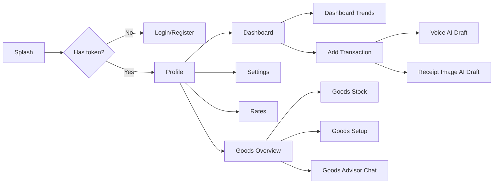

# Duet Finance Tracker - Technical Report

## 1. Introduction

Duet Finance Tracker is a mobile-first personal and shared finance application designed for couples and small households. The application helps users record income and expenses, monitor balances, view exchange rates, manage household goods, and use AI-assisted input for receipts and voice notes. The project also includes a Telegram companion bot and a web dashboard, but the final mobile app focus is the native Android client built with Kotlin and Jetpack Compose.

The main problem addressed by Duet is that household financial tracking often becomes fragmented. One person may record expenses in a notes app, another may use a spreadsheet, and important information such as receipts, pantry stock, shared purchases, and currency conversions can be lost. Duet brings those activities into one shared workspace so users can track daily spending and household inventory from a single interface.

### Problem Statement

Many existing finance apps are either individual-only, too complex for daily use, or not adapted to shared household routines. Couples need a lightweight way to record transactions, see shared financial history, manage common goods, and continue using the app even when the network is temporarily unavailable. The project solves this by combining a native Android application, a central backend API, PostgreSQL storage, offline create support, and AI-assisted data entry.

### Motivation and Objectives

The motivation for the project is to make household finance tracking faster, clearer, and more practical for real users. The key objectives are:

- Provide a native Android interface for daily finance tracking.
- Support personal and shared couple workspaces.
- Allow users to create, edit, delete, and review transactions.
- Show dashboard summaries, trends, recent activity, and exchange rates.
- Support household goods inventory and stock management.
- Add AI-powered receipt image and voice transaction drafting.
- Cache important data locally and queue creates while offline.
- Keep the backend, web app, Telegram bot, and Android app connected through a shared API and database.

## 2. System Overview

Duet is organized as a monorepo with separate applications and shared packages. The Android app is the mobile client. The API is the central business layer. PostgreSQL is the source of truth for users, couples, transactions, categories, goods, AI logs, and app preferences.

### Main Applications

- `apps/android`: Native Android client using Kotlin and Jetpack Compose.
- `apps/api`: NestJS API that exposes authentication, profile, dashboard, transaction, AI, and goods endpoints.
- `apps/web`: Next.js web interface for the same finance workspace.
- `apps/bot`: grammY Telegram bot that opens the web app and supports Telegram-based entry.
- `packages/db`: Prisma schema, migrations, and generated database client.
- `packages/config`: Shared environment parsing and validation.

### Target Users

The main target users are couples, roommates, and small households who need a shared finance and household goods tracker. A single user can also use the app individually, but the main design supports a shared workspace where both partners can see common financial activity.

### Key Features

- Email and password authentication.
- Profile and couple binding.
- Personal and shared transaction tracking.
- Income and expense categories.
- Dashboard with balance summaries, recent transactions, filters, and trend data.
- Currency rates and a quick exchange calculator.
- Receipt image upload for AI-generated transaction drafts.
- Voice note recording for AI-generated transaction drafts.
- Household goods overview, stock list, setup, history, and advisor chat.
- Offline create queue for transactions and goods items.
- Local cache for important data.
- Dark and light theme support.

## 3. Architecture and Design

The Android app follows an MVVM-style architecture. UI screens are written in Jetpack Compose. State and user actions are coordinated by `DuetViewModel`. Data access is handled by `DuetRepository`, which communicates with the remote API through Retrofit and stores local cached data through Room and DataStore.

### Android Component Structure

- `MainActivity`: Starts the Android app and hosts the Compose UI.
- `DuetApp`: Defines the main authenticated app shell and bottom navigation.
- `DuetViewModel`: Holds screen state, runs user actions, manages loading, mutation, voice recording, and AI draft flows.
- `DuetRepository`: Loads remote data, writes local cache, queues offline mutations, and calls API endpoints.
- `DuetApi`: Retrofit interface for backend endpoints.
- `DuetLocalDatabase`: Room database for cached JSON and outbox mutations.
- `OutboxSyncWorker`: WorkManager worker that syncs queued offline mutations.
- `ui/screens`: Compose screens for profile, dashboard, rates, transaction entry, goods, settings, and advisor chat.
- `ui/theme`: Duet colors, typography, and theme background.
- `voice`: Android voice recording and audio utility helpers.

### Navigation Flow

The app uses a single-activity Compose structure. After launch, the user moves through splash, authentication, and then the main workspace. The bottom navigation exposes the most important app areas: Goods, Dashboard, Add, Rates, and Profile. Secondary screens such as Trends, Settings, Goods Stock, Goods Setup, and Goods Advisor are opened from those main sections.

### Backend and Database Design

The API owns the application rules and connects to PostgreSQL using Prisma. The database contains models for users, couples, memberships, transactions, categories, invites, goods places, goods categories, goods items, goods item events, AI pricing, AI usage logs, AI threads, and AI messages. This keeps the Android, web, and Telegram clients consistent because all clients use the same backend and database.

The database design supports:

- User identity and profile preferences.
- Couple membership and shared visibility.
- Transaction history with category and currency data.
- Goods inventory with places, categories, units, stock events, and archive state.
- AI audit logging for model usage and cost tracking.
- Reusable AI chat threads for the goods advisor.

## 4. Implementation Highlights

### State Management

The Android app keeps UI state in `DuetUiState`, managed by `DuetViewModel`. Compose screens receive state and action handlers from the view model. This keeps UI rendering separate from business operations such as API calls, offline queueing, voice recording, and AI draft submission.

Important state areas include:

- Authentication token and bootstrap status.
- Profile, dashboard, rates, and goods snapshots.
- Current dashboard and goods filters.
- AI draft status, extracted fields, warnings, and errors.
- Voice recording state, timer, and live waveform levels.
- Offline outbox status messages.

### API Integration

The Android app uses Retrofit and OkHttp to call the NestJS API. Main API flows include:

- `auth/password/login` and `auth/password/register` for account access.
- `profile/me/snapshot` for the profile summary.
- `profile/me/dashboard` for transactions, charts, filters, and dashboard data.
- `profile/me/dashboard/rates` for exchange rates.
- `profile/me/transactions` for transaction creation.
- `profile/me/voice/draft` for AI voice transaction drafting.
- `profile/me/image/draft` for AI receipt drafting.
- `profile/me/goods/*` for goods inventory and setup.
- `profile/me/goods/advisor/*` for AI goods advisor conversations.

### Local Database and Offline Support

Room is used for two important local tables:

- `cached_json`: Stores serialized snapshots for faster reloads and graceful fallback.
- `outbox_mutation`: Stores pending offline creates for transactions and goods items.

When the device is offline, the app can queue supported create actions locally. WorkManager later sends those queued mutations to the server. Each queued mutation uses a client mutation id so duplicate creates can be avoided when reconnecting.

### AI Voice and Receipt Drafting

Duet includes two AI-assisted transaction entry flows:

1. Voice draft flow:
   - The user records a short finance voice note.
   - Android records speech-focused audio and displays waveform feedback.
   - The API transcribes the audio and extracts transaction fields.
   - The app shows the extracted amount, currency, category, note, warnings, and missing fields for review.

2. Receipt image draft flow:
   - The user uploads or captures a receipt image.
   - The API preprocesses the image, checks QR data when available, and calls the AI extraction flow when needed.
   - The Android review sheet displays extracted transaction fields and receipt quality details.

These features reduce manual typing and make the transaction entry process faster.

### UI and UX Design

The Duet design language uses a warm editorial visual style with calm colors, card-like surfaces, and clear hierarchy. The Android UI mirrors the web product with:

- A bottom navigation bar for core sections.
- A large centered add button for fast transaction entry.
- Themed buttons, fields, cards, status banners, and dark mode support.
- Compact mobile layouts for finance dashboards and goods inventory.
- Review sheets for AI-generated drafts before saving.

### Security and Stability

Security and stability decisions include:

- Encrypted storage for authentication tokens on Android.
- Server-side validation through NestJS DTOs and Prisma models.
- API-owned business rules so clients do not directly modify the database.
- AI usage logging for transparency and operational tracking.
- Timeouts and user-friendly error messages for long AI requests.
- Offline queueing for supported create actions.

## 5. Testing and Verification

The project includes focused JVM tests for Android data behavior:

- Currency formatting and normalization.
- Dashboard query building.
- Goods query building.
- DTO parsing.
- Voice audio utility behavior.

The repository also includes monorepo-level scripts for type checking and building the TypeScript applications. The final live demo should still be tested on an emulator or physical device before presentation, especially:

- Login/register.
- Dashboard loading.
- Transaction create/edit/delete.
- Voice transaction draft.
- Receipt image draft.
- Rates page.
- Goods overview, stock, setup, and advisor.
- Offline create and reconnect sync.

## 6. Challenges and Solutions

### Challenge 1: Sharing Data Across Web, Android, Bot, and API

The project includes multiple clients, so duplicating logic in every app would create inconsistency. The solution was to keep the NestJS API as the central business layer and PostgreSQL as the source of truth. Android, web, and Telegram all use the same server-side behavior.

### Challenge 2: Offline Mobile Usage

Mobile users may lose network connectivity while entering transactions or goods items. The solution was to add a Room-backed outbox and WorkManager sync. Supported creates are stored locally and sent later when the network returns.

### Challenge 3: AI Draft Reliability

Voice and image AI can return incomplete or uncertain results. The solution was to treat AI output as a draft instead of saving automatically. The app shows missing fields, warnings, quality issues, QR status, and extracted values so users can review before continuing.

### Challenge 4: Keeping the UI Consistent

The project has both web and Android interfaces. The solution was to define a shared visual direction and implement matching Android theme tokens, dark mode colors, reusable controls, and consistent navigation patterns.

### Challenge 5: Database Growth and Feature Scope

The app grew from transactions into goods inventory, AI logs, advisor threads, and offline idempotency. The solution was to extend the Prisma schema with related models instead of creating duplicate feature tables, while keeping migrations explicit.

## 7. Future Work

Planned improvements include:

- More complete Android emulator and real-device QA.
- Richer admin management for units of measurement.
- Notification delivery for goods expiration and stock reminders.
- More dashboard visual polish for balance cards and responsive consistency.
- Exportable reports for monthly spending and household summaries.
- Stronger end-to-end tests for Android flows.
- Optional push notifications for couple activity and pending sync status.

## 8. Conclusion

Duet Finance Tracker is a full-stack finance and household management system with a native Android app, backend API, PostgreSQL database, web interface, and Telegram companion bot. The Android app fulfills the core mobile development goals by using Kotlin, Jetpack Compose, MVVM-style state management, Retrofit API integration, Room local storage, WorkManager offline sync, and AI-assisted transaction entry. The project is practical, extensible, and suitable for real household finance tracking.

## Appendix: Technologies Used

- Kotlin
- Jetpack Compose
- Android ViewModel
- Retrofit
- OkHttp
- Room
- WorkManager
- DataStore
- Android Security Crypto
- NestJS
- Prisma
- PostgreSQL
- Next.js
- grammY Telegram bot
- Docker and Docker Compose
- OpenAI APIs for voice transcription and receipt/image extraction

